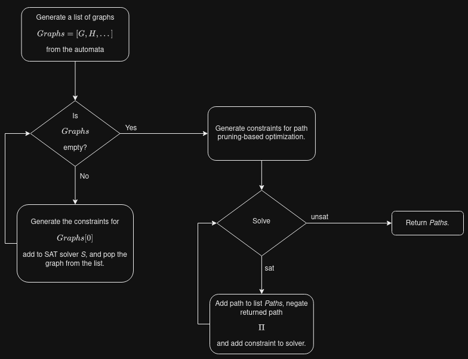

# Parallel Composition
A SAT-encoding for retrieving all paths at a given depth from the parallel composition of a graph in Python using z3Py.

## Constraints for an Individual Automata

Given an automata, we can find its underlying graph $G(V,E)$. Our aim is to generate SAT constraints to retrieve all paths from the graph such that depth is $k$. We add *stutter transitions* which are essentially self-loops. By depth, we denote the number of transitions in the path.

### INIT Clause
For all initial states, must include either of the outgoing edges in depth 1. Let us assume that the function $T(X)$ returns the outgoing transitions from the locations in set $X \subseteq V$, $V_{init} \subseteq V$ is the set of initial locations, and subscript denotes the depth at that transition.

$\bigvee_{t \in T(V_{init})}{t_1}$

### EXCLUDE Clause
If one edge is active at a given depth, no other edge can be active at that depth.

$\bigwedge_{1 \leq n \leq k}{\bigwedge_{i \in E}(i_n \implies -\bigvee_{j \in E\setminus i}{j_n})}$

### NEXT Clause
If an edge is active at a given depth, must include either of the outgoing edges from that location in the next depth.

$\bigwedge_{1 \leq n \leq k-1}{\bigwedge_{i = (u,v) \in E}(i_n \implies \bigvee_{j \in T(v)}{j_{n+1}})}$

### DEST Clause
At depth $k$, the edge must be an incoming edge of the location. Let us assume that the function $S(X)$ returns the incoming transitions to the locations in set $X \subseteq V$, and $V_{dest} \subseteq V$ is the set of destination (forbidden) locations.

$\bigvee_{t \in S(V_{dest})}{t_k}$

## Constraints for Path Pruning-Based Optimization

### GLOBAL WAITING Clause

All member automata are not allowed to enable the stutter transition simultaneously. Let us assume the function $T(H)$ returns all the possible stutter transitions of the graph $H$ and $G$ is an array of size $n$ of all underlying graphs of the automata in the composition. Superscript denotes the index of the underlying graph of the automata in the composition and subscript denotes the depth at that transition.

$\bigwedge_{1 \leq i \leq k}{-(\bigwedge_{0 \leq j \leq n-1}{t^j_i \in T(G[j])})}$

### REPEATED WAITING FOR SHARED LABELS Clause

For any shared label, all member automata with this specific shared label are not allowed to enable the stutter transition simultaneously. Let us assume $S'$ is the list of all shared transitions and the function $U(t)$ returns the set of underlying graphs for automata with the shared transition $t$.

$\bigwedge_{t \in S'}{\bigwedge_{2 \leq i \leq k}{(t_i \implies \bigvee_{j \in T(U(t))}{- j_{i-1}})}}$

### RANDOM WAITING Clause

For each member automaton, a stutter transition is allowed, if and only if its next label is a shared label or a stutter. Let us assume the function $V(H)$ returns the set of local transitions for a graph $H$.

$\bigwedge_{g \in G, t \in V(g)}{\bigwedge_{2 \leq i \leq k}{(t_i \implies - \bigvee_{g' \in G, t' \in T(g)}{t'_{i-1}})}}$

## Negation Clause

If the solver has retrieved a path, then we negate the path and add that constraint to the solver to return the next path. In our setting, the path retrieved is in the form of an array of Boolean variables. Suppose $\Pi$ is the array of all Boolean variables that are true for the particular model that the SAT solver has returned. The constraint for path negation is as follows:

$-\bigwedge_{x \in \Pi}{x}$

## Flow of the Algorithm

