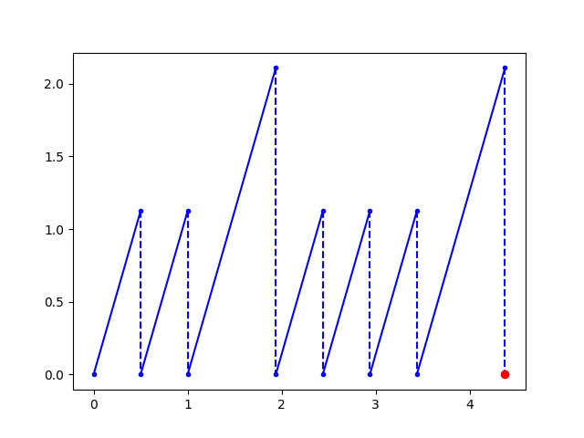

# SAT-Based Bounded Model Checking for Compositional Affine Hybrid Systems

To run unsafe instance of NRS 5 and get counterexample, run (with a minimum bound and time horizon; may change the variable for CE plotting):

`python3 main.py nrs_5_unsafe 10 91 controller_x`

To run safe instance of NRS 5 for a bound of 15, run:

`python3 main.py nrs_5_safe 15 100 controller_x`

To run unsafe instance of Ring Fischer 4 and get counterexample, run (with a minimum bound and time horizon; may change the variable for CE plotting):

`python3 main.py fischer_4_unsafe 7 1 p1_x`

